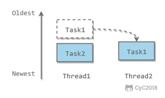
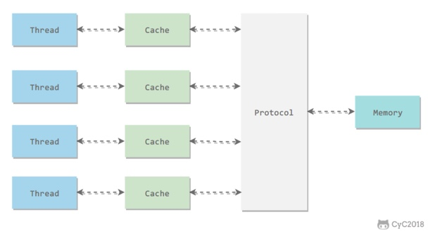
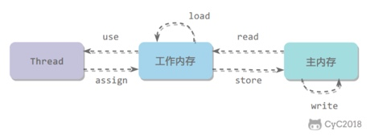
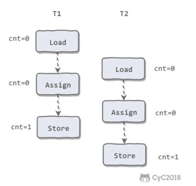
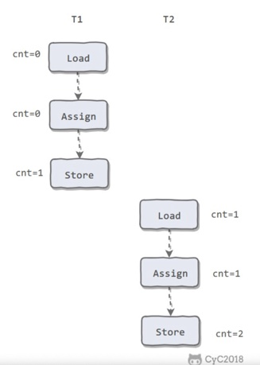
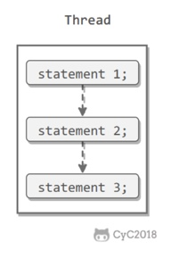
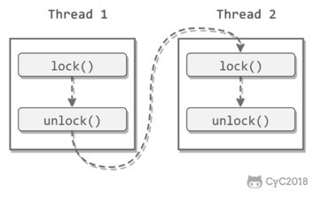
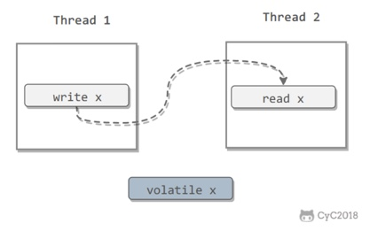
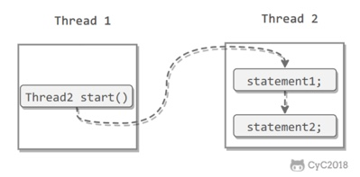
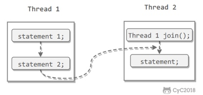

# 一、使用线程

有3种使用线程的方法
- 实现Runnable接口
- 实现Callable接口
- 继承Thread类

实现Runnable和Callable接口的类只能当作一个可以在线程中运行的任务，不是真正意义上的线程，因此最后还需要通过Thread来调用。
可以理解为任务是通过线程驱动从而执行的。

## Runnable

实现接口的run():
```java
public class MyRunnable implements Runnable {
    @Override
    public void run() {
        // ...
    }
}
```
使用Runnable实例再创建一个Thread实例，然后调用Thread实例的start()来启动线程

## Callable

与Runnable相比，Callable可以有返回值，返回值通过FutureTask进行封装

## 继承Thread

同样也是需要实现run(), 因为Thread也实现了Runnable接口
当调用start()启动；一个线程时，虚拟机会将该线程放入就绪队列中等待被调度，当一个线程被调度时会执行该线程的run()

## 实现接口 vs 继承Thread

实现接口会更好一些，因为：
- Java不支持多重继承，因此继承了Thread类就无法继承其他类，但是可以实现多个接口
- 类可能只要求可执行就行，继承整个Thread类开销过大

# 二、基础线程机制

## Executor

Executor管理多个异步任务的执行，而无需程序员显示地管理线程的生命周期。
这里的异步是指多个任务的执行不受干扰，不需要进行同步操作。

主要有3中Executor:
- CachedThreadPool: 一个任务创建一个线程
- FixedThreadPool: 所有任务只能使用固定大小的线程
- SingleThreadExecutor: 相当于大小为1的FixedThreadPool

## Daemon

守护线程是程序运行时在后台提供服务的线程，不属于程序中不可或缺的部分。
当所有非守护线程结束时，程序也就终止，同时会杀死所有守护线程。
main()属于非守护线程。
在线程启动之前使用setDaemon()可以将一个线程设置为守护线程。

## sleep()

`Thread.sleep(millisec)` 会休眠当前正在执行的线程。
`sleep()`可能会抛出`InterruptedException`, 因为异常不能跨线程传播回main()中，因此必须在本地进行处理。
线程中抛出的其他异常也同样需要在本地进行处理。

## yield()

对静态方法Thread.yield()的调用声明了当前线程已经完成了生命周期中最重要的部分，可以切换给其他线程来执行。
该方法只是对线程调度器的一个建议，而且也只是建议具有相同优先级的其他线程可以运行。

# 三、中断

一个线程执行完毕之后会自动结束，如果在运行过程中发生异常也会提前结束。

## InterruptedException

通过调用一个线程的interrupt()来中断该线程，如果该线程处于阻塞、限期等待或者无限期等待状态，那么就会抛出InterruptedException，
从而提前结束该线程，不执行之后的语句。

## interrupted()

如果一个线程的run()方法执行一个无限循环，并且没有执行sleep()等会抛出InterruptedException的操作，那么调用线程的interrupt()方法就无法使线程提前结束。
但是调用interrupt()会设置线程的中断标记，此时调用interrupted()会返回true。
因此可以在循环体中使用interrupted()来判断线程是否处于中断状态，从而提前结束线程。

## Executor的中断操作

调用Executor的shutdown()方法会等待线程都执行完毕之后再关闭，但是如果调用的是shutdownNow()，则相当于调用每个线程的interrupt()方法。

如果只想中断Executor中的一个线程，可以通过使用submit()来提交一个线程，它会返回一个`Future<?>`对象，通过调用该对象`cancel(true)`方法就可以中断该线程。

# 四、互斥同步

Java提供了两种锁机制来控制多个线程对共享资源的互斥访问，第一个是JVM实现的`synchronized`, 而另一个是JDK实现的`ReentrantLock`.

## synchronized

### 同步一个代码块：
```
public void func() {
    synchronized (this) {
        // ...
    }
}
```
它只作用同一个对象，如果调用两个对象上的同步代码块，就不会进行同步。

### 同步一个方法：
```
public synchronized void func() {
    // ...
}
```
和同步代码块一样，作用于同一个对象。

### 同步一个类
```
public void func() {
    synchronized (SynchronizedExample.class) {
        // ...
    }
}
```
作用于一整个类，也就是说两个线程调用同一个类的不同对象上的这种同步语句，也会进行同步。

### 同步一个静态方法
```
public synchronized static void func() {
    // ...
}
```
作用于整个类

## ReentrantLock

ReentrantLock是`java.util.concurrent`中的锁

## 比较
- synchronized 是JVM实现的，而ReentrantLock是JDK实现的
- 新版本Java对synchronized进行了很多优化，例如自旋锁等，synchronized与而ReentrantLock性能大致相同
- 当持有锁的线程长期不释放锁的时候，正在等待的线程可以选择放弃等待，改为处理其他事情。
ReentrantLock可中断，synchronized则不行。
  
- 公平锁是指多个线程在等待同一个锁时，必须按照申请锁的时间顺序来依次获得锁
  synchronized的锁是非公平的，ReentrantLock默认情况下也是非公平的，但是也可以是公平的。
  
- 一个ReentrantLock可以同时绑定多个Condition对象

## 使用选择
除非需要使用ReentrantLock的高级功能，否则优先使用synchronized。
这是因为synchronized是JVM实现的一种锁机制，JVM原生地支持它，而 ReentrantLock 不是所有的JDK版本都支持。
并且使用 synchronized 不用担心没有释放锁而导致死锁问题，因为JVM会确保锁的释放。

# 五、线程之间的协作
当多个线程可以一起工作去解决某个问题时，如果某些部分必须在其它部分之前完成，那么就需要对线程进行协调。

## join()
在线程中调用另一个线程的join(), 会将当前线程挂起，而不是忙等待，直到目标线程结束。

## wait(), notify(), and notifyAll()
调用 wait() 使得线程等待某个条件满足，线程在等待时会被挂起，当其它线程的运行使得这个条件满足时，
其它线程会调用 notify() 或者 notifyAll() 来唤醒挂起的线程。

它们都属于 Object 的一部分，而不属于Thread.

只能用在同步方法或者同步控制块中，否则会在运行时抛出 IllegalMonitorStateException.

使用 wait() 挂起期间，线程会释放锁。
这是因为，如果没有释放锁，那么其它线程就无法进入对象的同步方法或者同步控制块中，
那么就无法执行 notify() 或者 notifyAll() 来唤醒等待的线程，造成死锁。

## wait() VS sleep()
- wait() 是 Object 的方法，而 sleep() 是 Thread 的静态方法。
- wait() 会释放锁，而 sleep() 不会。

## await(), signal(), and signalAll()
`java.util.concurrent` 提供了 Condition 类来实现线程之间的协调，
可以在 Condition 上调用 await() 是线程等待，其它线程调用 signal() 或者 signalAll() 方法唤醒等待的线程。

相比于 wait(), await() 可以指定等待的条件，因此更加灵活。

# 六、线程状态
一个线程只能处于一种状态，并且这里的线程状态特质 Java 虚拟机的线程状态，不能反映线程在特定操作系统下的状态。

## 新建 (New)
创建后尚未启动。

## 可运行 (Runnable)
正在 Java 虚拟机中运行。
但是在操作系统层面，也可能等待资源调度（例如处理器资源），资源调度完成后就进入运行状态。
所以该状态的可运行是指可以被运行，具体有没有运行要看底层操作系统的资源调度。

## 阻塞 (Block)
请求获取 monitor lock 从而进入 synchronized 函数或者代码块，但是其它线程已经占用了该 monitor lock，所以出于阻塞状态。
要结束该状态进入从而 Runnable 需要其他线程释放 monitor lock。

## 无限期等待 (Waiting)
等待其它线程显示地唤醒。
阻塞和等待的区别在于，阻塞是被动的，它是在等待获取 monitor lock。
而等待是主动的，通过调用 Object.wait() 等方法进入该状态。

| 进入方法 | 退出方法 |
| --- | --- |
| 没有设置 Timeout 参数的 Object.wait() | {Object.notify() or Object.notifyAll()} by other threads |
| 没有设置 Timeout 参数的 Thread.join() | 被调用的线程执行完毕 |
| LockSupport.park() | LockSupport.unpack(Thread) |

## 限期等待 (Timed_waiting)
无需等待其它线程显示地唤醒，在一定时间之后会被系统自动唤醒。

| 进入方法 | 退出方法|
| --- | --- |
| Thread.sleep() | 时间结束 |
| 设置了 Timeout 参数的 Object.wait() | 时间结束 or Object.notify() or Object.notifyAll() |
| 设置了 Timeout 参数的 Thread.join() | 时间结束 or 被调用的线程执行完毕 |
| LockSupport.parkNanos() | LockSupport.unpack(Thread) |
| LockSupport.parkUntil() | LockSupport.unpack(Thread) |

调用 Thread.sleep() 方法使线程进入限期等待状态时，常常用“使一个线程睡眠”进行描述。
调用 Object.wait() 方法使线程进入限期等待或者无限期等待时，常常用“挂起一个线程”进行描述。
睡眠和挂起是用来描述行为，而阻塞和等待用来描述状态。

## 死亡 (Terminated)
可以是线程结束任务之后自己结束，或者产生了异常结束。

# J.U.C - AQS

`java.util.concurrent` 大大提升了并发性能，AQS被认为是 J.U.C 的核心。

## CountDownLatch
用来控制一个线程或多个线程等待多个线程.
维护了一个计数器cnt, 每次调用countDown()会让计数器的值减1， 减到0的时候，那些因为调用await()而在等待的线程就会被唤醒。

## CyclicBarrier

用来控制多个线程互相等待，只有当多个线程都到达时，这些线程才会继续执行。
和 CountDownLatch 类似，都是通过维护计数器来实现的。
线程执行 await() 之后计数器会减1，并进行等待，直到计数器为0，所有调用 await() 而在等待的线程才能继续执行。

CyclicBarrier 和 CountDownLatch 的一个区别是，CyclicBarrier 的计数器通过调用 reset() 可以循环使用，所以它才叫循环屏障。

CyclicBarrier 有两个构造函数，其中 parties 只是计数器的初始值，barrierAction 在所有线程都到达屏障的时候会执行一次。
```java
public class CyclicBarrier {
    
    public CyclicBarrier(int parties, Runnable barrierAction) {
        // ...
    }
    
    public CyclicBarrier(int parties) {
        this(parties, null);
    }
}
```

## Semaphore
Semaphore 类似于操作系统中的信号量，可以控制互斥资源的访问线程数。

# J.U.C - 其它组件

## FutureTask
Callable 可以有返回值，返回值通过 Future<V> 进行封装。
FutureTask 实现了 RunnableFuture 接口，该接口继承自 Runnable 和 Future<V> 接口，这使得 FutureTask 既可以当作一个任务执行，也可以有返回值。

FutureTask 可用于异步获取执行结果或取消执行任务的场景。
当一个计算任务需要执行很长时间，那么就可以用 FutureTask 来封装这个任务，主线程在完成自己的任务之后再去获取结果。

## BlockingQueue
`java.util.concurrent.BlockingQueue` 接口具有以下阻塞队列的实现：
- FIFO 队列：LinkedBlockingQueue, ArrayBlockingQueue (fixed length)
- 优先级队列：PriorityBlockingQueue

提供了阻塞的 take() and put(): 如果队列为空 take() 将阻塞，直到队列中有内容；如果队列为满 put() 将阻塞，直到队列有空闲位置。

## ForkJoin
主要用于并行计算，和 MapReduce 原理类似，都是把大的任务拆分成多个小任务并行计算。

ForkJoinPool 实现了工作窃取算法来提高 CPU 的利用率。
每个线程都维护了一个双端队列，用来存储需要执行的任务。
工作窃取算法允许空闲的线程从其它线程的双端队列中窃取一个任务来执行。
窃取的任务必须是 oldest, 避免和队列所属线程发生竞争
下图中，Thread2 从 Thread1 的队列中拿出最晚的任务 Task1， Thread1 会拿出 Task2 来执行，这样就比避免了发生竞争。
但是如果队列中只有一个任务，则竞争还是会发生。



# 九、线程不安全示例

如果多个线程对同一个共享数据进行访问而不采取同步措施的话，那么操作的结果是不一致的。

# 十、Java 内存模型

Java 内存模型试图屏蔽各种硬件和操作系统的内存访问差异，以实现让 Java 程序在各种平台上都能达到一致的内存访问效果。

## 主内存和工作内存
处理器上的寄存器的读写的速度比内存快几个数量级，为了解决这种速度矛盾，在它们之间加入了高速缓存。

加入高速缓存带来了一个新的问题：缓存一致性。
如果多个缓存共享同一快主内存区域，那么多个缓存的数据可能会不一致，需要一些协议来解决这个问题。



所有的变量都存储在主内存中，每个线程还有自己的工作内存，工作内存存储在高速缓存或者寄存器中，保存了该线程使用的变量的主内存副本拷贝。

线程也只能操作工作内存中的变量，不同线程之间的变量值传递需要通过主内存来完成。

## 内存间相互操作
Java 内存模型定义了8个操作来完成主内存和工作内存的交互操作：



- read: 把一个变量的值从主内存传输到工作内存中
- load: 在 read 执行后，把 read 得到的值放入工作内存的变量副本中
- use: 把工作内存中一个变量的值传递给执行引擎
- assign: 把一个从执行引擎接收到的值赋给工作内存的变量
- store: 把工作内存的一个变量的值传送到主内存中
- write: 在 store 之后执行，把 store 得到的值放入主内存的变量中
- lock: 作用于主内存的变量
- unlock

## 内存模型三大特性
### 原子性
Java 内存模型保证了以上8个操作具有原子性。
例如对一个 int 型的变量执行 assign 赋值操作，这个操作就是原子性的。
但是 Java 内存模型允许虚拟机将没有被 volatile 修饰的64位数据 (long, double) 的读写操作划分为两次 32 位的操作来进行。

一个错误认知就是，int 等原子性的类型在多线程环境中不会出现线程安全问题。
对 int 类型读写操作满足原子性只是说明 load, assign, store 这些单个操作具备原子性。



AtomicInteger 能保证多个线程修改的原子性



除了使用原子类之外，也可以使用 synchronized 互斥锁来保证操作的原子性。
它对应的内存间交互操作为：lock, unlock, 在虚拟机实现上对应的字节码指令为 monitorenter and monitorexit.

### 可见性
可见性指当一个线程修改了共享变量的值，其它线程能够立即得知这个修改。
Java 内存模型是通过在变量修改后将新值同步回主内存，在变量读取前从主内存刷新变量值来实现可见性的。

主要有3中实现可见性的方式：
- volatile
- synchronized, 对一个变量执行 unlock 操作之前，必须把变量值同步回主内存。
- final, 被 final 关键字修饰的字段在构造器中一旦初始化完成，并且没有发生 this 逃逸（其它线程通过 this 引用访问到初始化了一半的对象），那么其它线程就能看见 final 字段的值。

对 ThreadUnsafeExample.class 中的 cnt 变量使用 volatile 修饰，不能解决线程不安全问题，因为 volatile 并不能保证操作的原子性。

### 有序性
有序性是指：在本线程内观察，所有操作都是有序的。
在一个线程观察另一个线程，所有操作都是无序的。
无序是因为发生了指令重排序。
在 Java 内存模型中，允许编译器和处理器对指令进行重排序，重排序过程不会影响到单线程程序的执行，却会影响到多线程并发执行的正确性。

volatile 通过添加内存屏障的方式来禁止指令重排，即重排序时不能把后面的指令放到内存屏障之前。

也可以通过 synchronized 来保证有序性，它保证每个时刻只有一个线程执行同步代码，相当于是让线程顺序执行同步代码。

## 先行发生原则
JVM 规定了先行发生原则，让一个操作无需控制就能先于另一个操作完成。

### 单一线程原则
在一个线程内，在程序前面的操作先行发生于后面的操作。



### 管程锁定原则
一个 unlock 操作先行发生于后面对同一个锁的 lock 操作。



### volatile 变量规则
对一个 volatile 变量的写操作先行发生于后面对这个变量的读操作



### 线程启动规则
Thread 对象的 start() 方法调用先行发生于此线程的每一个动作。



### 线程加入规则
Thread 对象的结束先行发生于 join() 方法返回



### 线程中断规则
对线程 interrupt() 方法的调用先行发生于被中断线程的代码检测到中断事件的发生，可以通过 interrupted() 方法检测到是否有中断发生。

### 对象终结规则
一个对象的初始化完成（构造函数执行结束）先行发生于它的 finalize() 方法的开始。

### 传递性
如果操作 A 先行发生于 B，操作 B 先行发生于操作 C，那么操作 A 先行发生于操作 C。

# 十一、线程安全
线程安全指多个线程不管以何种方式访问某个类，并且在主调用代码中不需要进行同步，都能表现正确的行为。

线程安全有以下几种实现方式：

## 不可变
不可变的对象一定是线程安全的，不需要再采取任何的线程安全保障措施。
只要一个不可变的对象被正确地构建出来，永远也不会看到它在多个线程之中处于不一致的状态。
多线程环境下，应当尽量使对象成为不可变，来满足线程安全。

不可变的类型：
- final 修饰的基本数据类型
- String
- 枚举类型
- Number 部分子类，如 Long 和 Double 等数值包类型，BigInteger 和 BigDecimal 等大数据类型。
但同为 Number 的原子类 AtomicInteger 和 AtomicLong 则是可变的。
  
对于集合类型，可以使用 `Collections.unmodifiableXXX()` 方法来获取一个不可变的集合。
```java
public class ImmutableExample {

    public static void main(String[] args) {
        Map<String, Integer> map = new HashMap<>();
        Map<String, Integer> unmodifiableMap = Collections.unmodifiableMap(map);
        unmodifiableMap.put("a", 1);
    }
}
```
`Collections.unmodifiableXXX()` 先对原始的集合进行拷贝，需要对集合进行修改的方法都直接抛出异常。

## 互斥同步
synchronized and ReentrantLock.

## 非阻塞同步
互斥同步最主要的问题就是线程阻塞和唤醒所带来的性能问题，因此这种同步也成为阻塞同步。

互斥同步属于一种悲观的并发策略，总是认为只要不去做正确的同步措施，那就肯定会出现问题。
无论共享数据是否真的会出现竞争，它都要进行加锁（这里讨论的是概念模型，实际上虚拟机会优化掉很大一部分不必要的加锁）、用户态核心态转换、维护锁计数器和检查是否有被阻塞线程需要唤醒等操作。

随着硬件指令集的发展，我们可以使用基于冲突检测的乐观并发策略：
先进行操作，如果没有其它线程争用共享数据，那操作就成功了，否则采取补偿措施（不断地重试，直到成功为止）。
这种乐观的并发策略的许多实现都不需要将线程阻塞，因此这种同步操作成为线程非阻塞同步。

### CAS
乐观锁需要操作和冲突检测这两个步骤具有原子性，这里就不能再使用互斥同步来保证了，只能靠硬件来完成。
硬件支持的原子性操作最典型的是：比较并交换 (Compare-and-Swap, CAS)。
CAS 指令需要有3个操作数，分别是内存地址 V、旧的预期值 A 和新值 B。
当执行操作时，只有当 V 的值等于 A，才将 V 的值更新为 B。

举例分析：
- 设定 AtomicInteger 的 value 原始值为 A，从 Java 内存模型得知，线程 1 和线程 2 各自持有一份 value 的副本，值都是 A。
- 线程 1 通过 `getIntVolatile(var1, var2)` 拿到 value 值 A，这时线程 1 被挂起。
- 线程 2 也通过 `getIntVolatile(var1, var2)` 方法获取到 value 值 A，并执行 `compareAndSwapInt` 方法比较内存值也为 A，成功修改内存值为 B。
- 这时线程 1 恢复执行 `compareAndSwapInt` 方法比较，发现自己手里的值 A 和内存的值 B 不一致，说明该值已经被其它线程提前修改过了。
- 线程 1 重新执行 `getIntVolatile(var1, var2)` 再次获取 value 值，因为变量 value 被 volatile 修饰，所以其它线程对它的修改，线程 A 总是能够看到，线程A继续执行 `compareAndSwapInt` 进行比较替换，直到成功。

### AtomicInteger
原子类 AtomicInteger 的方法调用了 Unsafe 类的 CAS 操作。

### ABA
如果一个变量初次读取的时候是 A 值，它的值被改成了 B，后来又被改回 A，那 CAS 操作就会误认为它从来没有被改变过。

J.U.C 包提供了一个带有标记的原子引用类 AtomicStampedReference 来解决这个问题，
它可以通过控制变量值的版本来保证 CAS 的正确性。

大部分情况下 ABA 问题不会影响程序并发的正确性，如果需要解决 ABA 问题，该用传统的互斥同步可能会比原子类更高效。

## 无同步方案
要保证线程安全，并不是一定就要进行同步。
如果一个方法本来就不涉及共享数据，那它自然就无须任何同步措施去保证正确性。

### 栈封闭
多个线程访问同一个方法的局部变量时，不会出现线程问题，因为局部变量存储在虚拟机栈中，属于线程私有的。

### 线程本地存储
如果一段代码中所需要的数据必须与其它代码共享，那就看看这些共享数据的代码是否能保证在同一个线程中执行。
如果能保证，我们就可以把共享数据的可见范围限制在同一个线程之内，这样，无须同步也能保证线程之间不会出现数据争用的问题。

符合这种特点的应用并不少见，大部分使用消费队列的架构模式（如"生产者-消费者"模式）都会将产品的消费过程尽量在一个线程中消费完。
其中最重要的一个应用实例就是经典 Web 交互模型中的"一个请求对应一个服务器线程"的处理方式，
这种处理方式的广泛应用使得很多 Web 服务端应用都可以使用线程本地存储来解决线程安全问题。

可以使用 `java.lang.ThreadLocal` 类来实现线程本地存储功能。

每个 ThreadLocal 都有一个 ThreadLocal.ThreadLocalMap 对象。
当调用一个 ThreadLocal 对象的 `set(T value)` 方法时，先得到向前线程的 ThreadLocalMap 对象，
然后将 ThreadLocal -> value 键值对插入到该 Map 中。

ThreadLocal 理论上来讲不是用来解决多线程并发问题的，因为根本不存在多线程竞争。
在一些场景（尤其是使用线程池）下，由于 ThreadLocal.ThreadLocalMap 的底层数据结构导致 ThreadLocal有内存泄漏的情况。
应该尽可能在每次使用 ThreadLocal 后手动调用 remove(), 以避免出现 ThreadLocal 经典的内存泄漏甚至是造成自身业务混乱的风险。

# 十二、锁优化
这里的锁优化主要指的是 JVM 对 synchronized 的优化

## 自旋锁
互斥同步进入阻塞状态的开销都很大，应该尽量避免。
在许多应用中，共享数据的锁定状态只会持续很短的一段时间。
自旋锁的思想是让一个线程在请求一个共享数据的锁时执行忙循环（自旋）一段时间，如果在这段时间内能获得锁，就可以避免进入阻塞状态。

自旋锁虽然能避免进入阻塞状态从而减少开销，但是它需要进行忙循环操作占用 CPU 时间，它只适用于共享数据的锁定状态很短的场景。

在 JDK1.6 中引入了自适应的自旋锁。
自适应意味着自选的次数不在固定了，而是由前一次在同一个锁上的自旋次数及锁的拥有者的状态来决定。

## 锁消除
是指对于被检测出不可能存在竞争的共享数据的锁进行消除。

锁消除主要通过逃逸分析来支持，如果堆上的共享数据不可能逃逸出去被其它线程访问到，那么就可以把它们当成私有数据对待，也就可以将它们的锁进行消除。

String 是一个不可变的类，编译器会对 String 的拼接自动优化。
在 JDK1.5 之前，会转化为 StringBuffer 对象的连续 append() 操作：
```java
public class StringLock {

  public static String concatString(String s1, String s2, String s3) {
    StringBuffer sb = new StringBuffer();
    sb.append(s1);
    sb.append(s2);
    sb.append(s3);
    return sb.toString();
  }
}
```
每个 append() 中都有一个同步块。
( StringBuilder 的 append() 没有 synchronized 关键字修饰)
虚拟机观察变量 sb，很快就会发现它的动态作用域被限制在 concatString() 内部。
也就是说，sb 的所有引用永远不会逃逸到 concatString() 之外，其它线程无法访问到它，因此可以进行消除。

## 锁粗化
如果一系列的连续操作都对同一个对象反复加锁和解锁，频繁的加锁操作就会导致性能损耗。

连续的 append() 就属于这一情况。
如果虚拟机探测到这样的一串零碎的操作都对同一个对象加锁，
将会把锁的范围扩展（粗化）到整个操作序列的外部。
对于连续的 append() 就是扩展到第一个 append() 操作之前直至最后一个 append() 操作之后，这样只需加锁一次就行了。